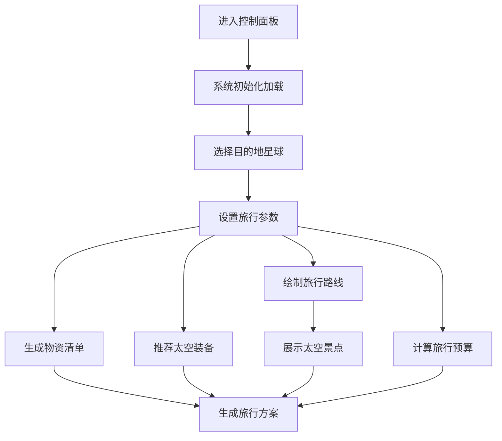

## 1. 产品概述

星际旅行计划制定工具 - 一个科幻未来风格的太空旅行规划平台，模拟宇宙飞船控制面板，让用户体验沉浸式的太空旅行规划过程。

- 产品定位：面向太空探索爱好者的纯前端旅行规划应用，提供从目的地选择到预算计算的一站式太空旅行方案制定
- 核心价值：通过炫酷的科幻视觉效果和完整的旅行规划功能，为用户带来沉浸式的太空旅行体验
- 目标用户：科幻爱好者、太空探索迷、科技产品用户

## 2. 核心功能

### 2.1 用户角色
| 角色 | 注册方式 | 核心权限 |
|------|----------|----------|
| 旅行者 | 无需注册 | 使用所有旅行规划功能，查看星球数据和装备信息 |

### 2.2 功能模块
1. **控制面板主页**：飞船仪表盘风格的主界面，展示系统状态和导航入口
2. **星球选择模块**：可视化星球选择器，展示各星球详细信息
3. **旅行规划模块**：时长设置、日期选择、同行人数配置
4. **物资清单模块**：根据旅行参数自动生成所需物资清单
5. **装备推荐模块**：基于目的地和时长推荐太空装备
6. **路线绘制模块**：可视化太空旅行路线，显示途经景点
7. **景点介绍模块**：太空景点卡片展示，包含详细介绍
8. **预算计算模块**：实时计算旅行总费用，包含各项明细

### 2.3 页面详情
| 页面名称 | 模块名称 | 功能描述 |
|----------|----------|----------|
| 控制面板主页 | 飞船仪表盘 | 系统状态显示、功能导航、全局数据概览 |
| 控制面板主页 | 星球选择器 | 从模拟接口加载星球数据，支持筛选和搜索 |
| 控制面板主页 | 旅行时长规划 | 滑块/输入框设置旅行天数，选择出发日期 |
| 控制面板主页 | 物资清单 | 根据参数动态生成物资列表，显示数量和重要性 |
| 控制面板主页 | 装备推荐 | 分类展示推荐装备，支持查看详情 |
| 控制面板主页 | 路线绘制 | SVG/Canvas绘制星际航线，标记景点位置 |
| 控制面板主页 | 景点介绍 | 卡片式展示太空景点，支持轮播切换 |
| 控制面板主页 | 预算计算 | 实时更新费用明细，支持导出预算表 |

## 3. 核心流程

用户进入飞船控制面板 → 选择目的地星球 → 设置旅行时长和人数 → 查看自动生成的物资清单和装备推荐 → 浏览旅行路线和途经景点 → 查看实时预算计算 → 完成旅行方案制定

## 4. 用户界面设计

### 4.1 设计风格
- **主色调**：深空蓝 (#0a1628) + 银灰 (#c0c5ce) + 霓虹紫 (#9d4edd)
- **辅助色**：霓虹青 (#00f5d4)、警示红 (#ff006e)、能源黄 (#ffbe0b)
- **按钮风格**：科幻感边框、发光效果、悬停动画
- **字体**：主标题使用 Orbitron 科幻字体，正文使用 Rajdhani 现代无衬线字体
- **布局风格**：宇宙飞船控制台布局，分区域模块，边框装饰，扫描线效果
- **图标风格**：线性科幻图标，霓虹发光效果

### 4.2 页面设计概述
| 页面名称 | 模块名称 | UI 元素 |
|----------|----------|----------|
| 控制面板主页 | 飞船仪表盘 | 全息投影风格标题、系统状态指示灯、数据跳动动画 |
| 控制面板主页 | 星球选择器 | 3D 悬浮星球卡片、选中发光效果、加载骨架屏 |
| 控制面板主页 | 旅行规划 | 霓虹滑块、环形进度条、日期选择器 |
| 控制面板主页 | 物资清单 | 分类标签、数量调节器、重要性指示器 |
| 控制面板主页 | 装备推荐 | 卡片网格、悬停翻转动画、详情弹窗 |
| 控制面板主页 | 路线绘制 | 星空背景、动态航线、脉冲标记点 |
| 控制面板主页 | 景点介绍 | 3D 卡片轮播、视差滚动效果 |
| 控制面板主页 | 预算计算 | 数字滚动动画、费用堆叠图、导出按钮 |

### 4.3 响应式
- 桌面端优先设计，完整展示所有模块
- 平板端自适应网格布局，模块重排
- 移动端单列堆叠布局，折叠次要功能
- 触控优化：增大点击区域，支持手势滑动

### 4.4 视觉特效
- **粒子背景**：Canvas 实现的星空粒子动画，模拟宇宙空间
- **霓虹效果**：文字和边框的发光效果，支持呼吸动画
- **扫描线**：CRT 显示器风格的扫描线覆盖层
- **数据跳动**：数字变化时的滚动动画
- **全息投影**：半透明渐变 + 模糊效果模拟全息影像
- **脉冲动画**：选中状态的脉冲波纹效果
