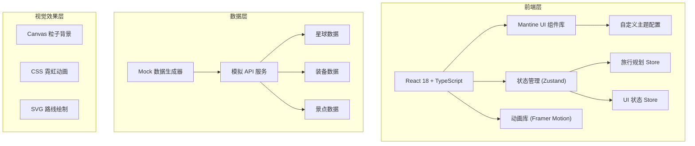

## 1. 架构设计



## 2. 技术描述

- **前端框架**：React 18 + TypeScript
- **构建工具**：Vite 5
- **UI 组件库**：Mantine UI 7（自定义科幻主题）
- **状态管理**：Zustand
- **动画库**：Framer Motion
- **图标库**：Lucide React
- **数据模拟**：自定义 Mock API + setTimeout 模拟网络延迟
- **样式方案**：Mantine CSS-in-JS + 自定义 CSS 变量

## 3. 目录结构

```
src/
├── components/
│   ├── layout/
│   │   ├── ControlPanel.tsx      # 控制面板主布局
│   │   ├── DashboardHeader.tsx   # 仪表盘头部
│   │   └── StatusBar.tsx         # 系统状态栏
│   ├── planet/
│   │   ├── PlanetSelector.tsx    # 星球选择器
│   │   ├── PlanetCard.tsx        # 星球卡片
│   │   └── PlanetDetails.tsx     # 星球详情
│   ├── travel/
│   │   ├── TravelPlanner.tsx     # 旅行规划
│   │   ├── SupplyList.tsx        # 物资清单
│   │   └── BudgetCalculator.tsx  # 预算计算
│   ├── equipment/
│   │   ├── EquipmentCard.tsx     # 装备卡片
│   │   └── EquipmentList.tsx     # 装备列表
│   ├── route/
│   │   ├── RouteMap.tsx          # 路线地图
│   │   └── AttractionCard.tsx    # 景点卡片
│   └── effects/
│       ├── StarField.tsx         # 星空粒子背景
│       └── NeonEffects.tsx       # 霓虹效果组件
├── store/
│   └── useTravelStore.ts         # 旅行规划状态
├── data/
│   ├── mockApi.ts                # 模拟 API
│   ├── planets.ts                # 星球数据
│   ├── equipment.ts              # 装备数据
│   └── attractions.ts            # 景点数据
├── types/
│   └── index.ts                  # 类型定义
├── utils/
│   ├── calculations.ts           # 计算工具函数
│   └── animations.ts             # 动画配置
├── theme/
│   └── mantineTheme.ts           # Mantine 主题配置
├── App.tsx
├── main.tsx
└── index.css
```

## 4. 数据模型

### 4.1 类型定义

```typescript
// 星球
interface Planet {
  id: string;
  name: string;
  nameEn: string;
  description: string;
  distance: number; // 距离地球(光年)
  travelDays: number; // 建议旅行天数
  gravity: number; // 重力(G)
  temperature: string; // 温度范围
  atmosphere: string; // 大气成分
  difficulty: 'easy' | 'medium' | 'hard' | 'extreme';
  image: string;
  attractions: string[];
  baseCost: number; // 基础费用
}

// 太空装备
interface Equipment {
  id: string;
  name: string;
  category: 'suit' | 'tool' | 'medical' | 'survival' | 'luxury';
  description: string;
  price: number;
  weight: number;
  required: boolean;
  recommendedPlanets: string[];
  image: string;
}

// 太空景点
interface Attraction {
  id: string;
  name: string;
  planetId: string;
  description: string;
  highlights: string[];
  bestTime: string;
  duration: number; // 游览时间(小时)
  image: string;
}

// 物资
interface Supply {
  id: string;
  name: string;
  category: 'food' | 'water' | 'oxygen' | 'medical' | 'other';
  unit: string;
  perPersonPerDay: number;
  importance: 'critical' | 'high' | 'medium' | 'low';
}

// 旅行方案
interface TravelPlan {
  destination: Planet | null;
  startDate: Date | null;
  durationDays: number;
  travelers: number;
  selectedEquipment: string[];
  totalBudget: number;
}
```

### 4.2 模拟 API

```typescript
// 获取所有星球
const getPlanets = (): Promise<Planet[]> => {
  return new Promise((resolve) => {
    setTimeout(() => resolve(planetsData), 800 + Math.random() * 400);
  });
};

// 获取装备列表
const getEquipment = (planetId?: string): Promise<Equipment[]> => {
  return new Promise((resolve) => {
    setTimeout(() => {
      const data = planetId 
        ? equipmentData.filter(e => e.recommendedPlanets.includes(planetId))
        : equipmentData;
      resolve(data);
    }, 600 + Math.random() * 300);
  });
};

// 获取景点列表
const getAttractions = (planetId: string): Promise<Attraction[]> => {
  return new Promise((resolve) => {
    setTimeout(() => {
      resolve(attractionsData.filter(a => a.planetId === planetId));
    }, 500 + Math.random() * 300);
  });
};
```

## 5. 状态管理 (Zustand)

```typescript
interface TravelState {
  // 旅行参数
  destination: Planet | null;
  startDate: Date | null;
  durationDays: number;
  travelers: number;
  
  // 数据状态
  planets: Planet[];
  equipment: Equipment[];
  attractions: Attraction[];
  loading: { planets: boolean; equipment: boolean; attractions: boolean };
  
  // 选择状态
  selectedEquipment: string[];
  
  // 计算属性
  supplies: SupplyItem[];
  totalBudget: BudgetDetail;
  
  // Actions
  setDestination: (planet: Planet | null) => void;
  setDuration: (days: number) => void;
  setTravelers: (count: number) => void;
  setStartDate: (date: Date | null) => void;
  toggleEquipment: (id: string) => void;
  loadPlanets: () => Promise<void>;
  loadEquipment: (planetId?: string) => Promise<void>;
  loadAttractions: (planetId: string) => Promise<void>;
  calculateSupplies: () => void;
  calculateBudget: () => void;
}
```

## 6. 预算计算逻辑

```
总费用 = 
  基础费用 (星球基础费用 × 人数 × 难度系数)
+ 交通费用 (距离 × 10000 × 人数)
+ 住宿费用 (星球每日费用 × 天数 × 人数)
+ 装备费用 (选中装备总价)
+ 餐饮费用 (人数 × 天数 × 500)
+ 景点门票 (景点数 × 人数 × 300)
+ 保险费用 (总基础费用 × 0.15)
+ 紧急备用金 (总费用 × 0.1)
```
